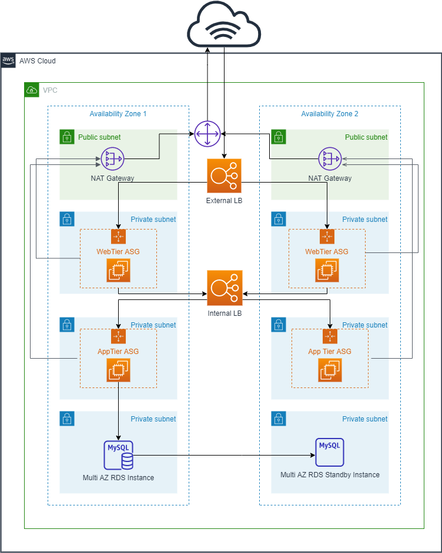

# Introduction
This repository contains the code for the KPMG challenge and below is the architectural diagram for the three tier environment.

## Important Information
1. Create a SecureString parameter in the SSM Parameter store for your RDS Instance password and provide the nmae of the SSM parameter when creating the data tier.
2. For simplicity, the Application Servers also have an Apache HTTP Server running on it, and this is to validate connectivity to the Application Server can only be accessed from the Web Servers via the Internal Load balancer.
